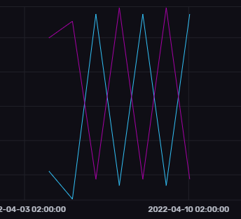

For our next step, we want to load data in a .csv-format into InfluxDB. As our datasource, we are going to use a demo file locatet at `var/lib/influxdb2/test_data_2.csv` inside the InfluxDB docker container and under `influxdb2/test_data_2.csv`{{open}} on the virtual machine. The contents look like this and contain timeseries data on memory usage on two different hosts:


    #datatype measurement,tag,double,dateTime:RFC3339
    m,host,used_percent,time
    mem,host1,64.23,2022-04-04T00:00:00Z

The first line defines the datatypes used for the different columns. The second line defines the names of the columns, and the following columns are actual data.


By executing this command we can load data into our bucket.```docker exec dwh-influxdb influx write -b dwh-data -f var/lib/influxdb2/test_data_2.csv```{{execute}}

Once the data has been loaded into our bucket, we can view it from inside the web interface. Head over to the "Explore" tab. Here you can select the data you want either via a graphical query builder, or via a string query.

To select our data via the query builder, simply filter by the tags we have set for our values, in our case `mem` for `_measurement`, `used_percent` for `_field` and `host1` and `host2` for `host`. Alternatively you could use below query for the string query editor to achieve the same result.

<pre class="file" data-target="clipboard">
from(bucket: "dwh-data")
    |> range(start: v.timeRangeStart, stop: v.timeRangeStop)
    |> filter(fn: (r) => r["_measurement"] == "mem")
    |> filter(fn: (r) => r["_field"] == "used_percent")
    |> filter(fn: (r) => r["host"] == "host1" or r["host"] == "host2")
    |> aggregateWindow(every: v.windowPeriod, fn: mean, createEmpty: false)
    |> yield(name: "mean")
</pre>

Regardless of which way you use, your displayed data should look something like this:



In case the data doesn't show up at all, try changing the view date to include the days around the 15th April 2022.

