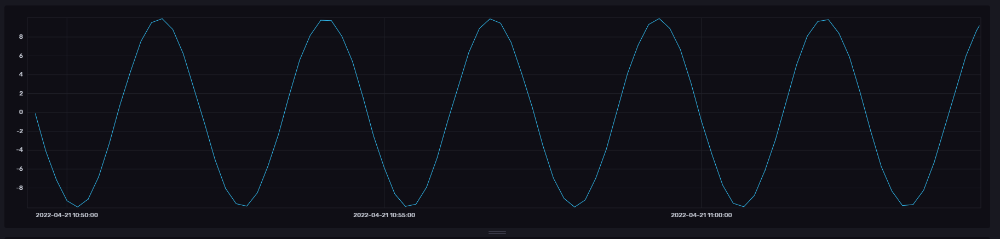

For our next step we need to install the relevant python libraries and create a token to enable our python code access to the InfluxDB. We can install the library with pip `pip install influxdb-client`{{execute}}. The next command creates a new all-access token. ```docker exec dwh-influxdb influx auth create --org dwh-org --all-access```{{execute}} Copy the token (long string that ends in "==") and save it, we are going to need it later. Alternatively you could also create a new token via the GUI, under "Data">"API Tokens">"Generate API Token".


The python script (located under `influxdb2/write_to_influxdb.py`{{open}}) looks like this:

<pre class="file" data-target="clipboard">
import influxdb_client
from influxdb_client.client.write_api import SYNCHRONOUS
</pre>

First we need to import the relevant libraries we just installed.

<pre class="file" data-target="clipboard">
bucket = "dwh-data"
org = "dwh-org"
token = ""
url=""

client = influxdb_client.InfluxDBClient(
    url=url,
    token=token,
    org=org
)
</pre>

We then store relevant data about our bucket, organization and token in variables, and use them to instantiate a `influxdb_client`. Open the file in the Katacoda editor and edit the variables `token` and `url`. Paste the token you copied earlier into the `token` variable, and set the url variable to this url:
https://[[HOST_SUBDOMAIN]]-8086-[[KATACODA_HOST]].environments.katacoda.com/

<pre class="file" data-target="clipboard">
write_api = client.write_api(write_options=SYNCHRONOUS)
</pre>

The `influxdb_client` has a `write_api` method that can be used to instantiate the writer object. 

<pre class="file" data-target="clipboard">
p = influxdb_client.Point("my_measurement").tag("location", "Prague").field("temperature", 25.3)
write_api.write(bucket=bucket, org=org, record=p)
</pre>

For our last step, we create a `point` object that we then insert into our bucket.

`python3 influxdb2/write_to_influxdb.py`{{execute}} 


If we execute the script, it will now continuously create data and fill it into our bucket. To view our data, once again select the data source in the query builder by firstly removing the old filters and then filtering the tags as follows: `my_measurement` for `_measurement`, `my_value` for `_field` and `my_location` for `location`. Alternatively you could use below query for the string query editor to achieve the same result.

<pre class="file" data-target="clipboard">
from(bucket: "dwh-data")
  |> range(start: v.timeRangeStart, stop: v.timeRangeStop)
  |> filter(fn: (r) => r["_measurement"] == "my_measurement")
  |> filter(fn: (r) => r["_field"] == "my_value")
  |> filter(fn: (r) => r["location"] == "my_location")
  |> aggregateWindow(every: v.windowPeriod, fn: last, createEmpty: false)
  |> yield(name: "last")
</pre>

The resulting graph should look something like this, though it might take some time to sufficiently fill the bucket:



If you want to learn more about using Python together with InfluxDB, check out [this official article](https://www.influxdata.com/blog/getting-started-python-influxdb/) from influxdata.